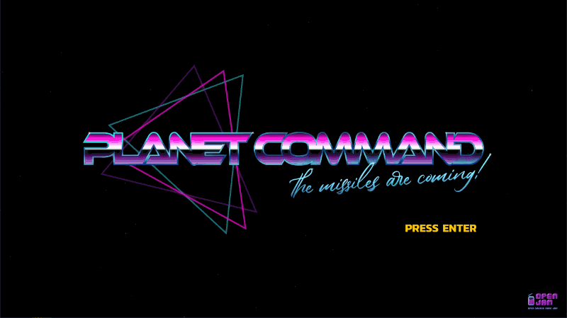

In the year 20XX, after most of the world has been destroyed by mysterious little green missiles from space, only 4 cities remain able to defend the planet!

Command the cannons to destroy the lasers and SAVE THE WORLD!

Beware, the cannons can overheat!

## About

Developed for the [Open Jam 2019](https://itch.io/jam/open-jam-2019) with the goal of using as many open source tools and assets as possible. The compiled game can be found on the itch.io page here: <https://atolverderben.itch.io/planet-command>

## Todo

* Waves
* Upgrades
* UFOs (Started)
  * Add death animation
* Smart Bombs
* Improved AI

### Open Source Goodness

* Written in Go <https://github.com/golang/go>
* Ebiten (Apache 2.0) <https://ebiten.org>
* Tentsuyu (Apache 2.0) <https://github.com/atolVerderben/tentsuyu>
* Kanit font: <https://github.com/cadsondemak/kanit>
* All art by me, will release some form of CC
* Created in VS Code
* GIMP for image manipulation
* SE CC0 by rubberduck: <https://opengameart.org/content/50-cc0-retro-synth-sfx> and <https://opengameart.org/content/50-cc0-sci-fi-sfx>
* BGM "Falling Organ" CC-by-4.0 by primallight: <https://opengameart.org/content/space-fast-synth-epic-themes>

#### Licenses

 All visual art files (.png) under assests folder were created by me, atolVerderben, and are available under the [CC-BY 4.0](https://creativecommons.org/licenses/by/4.0/legalcode). Please just attribute atolVerderben and link back to this github page: <https://github.com/atolVerderben/planetcommand>
